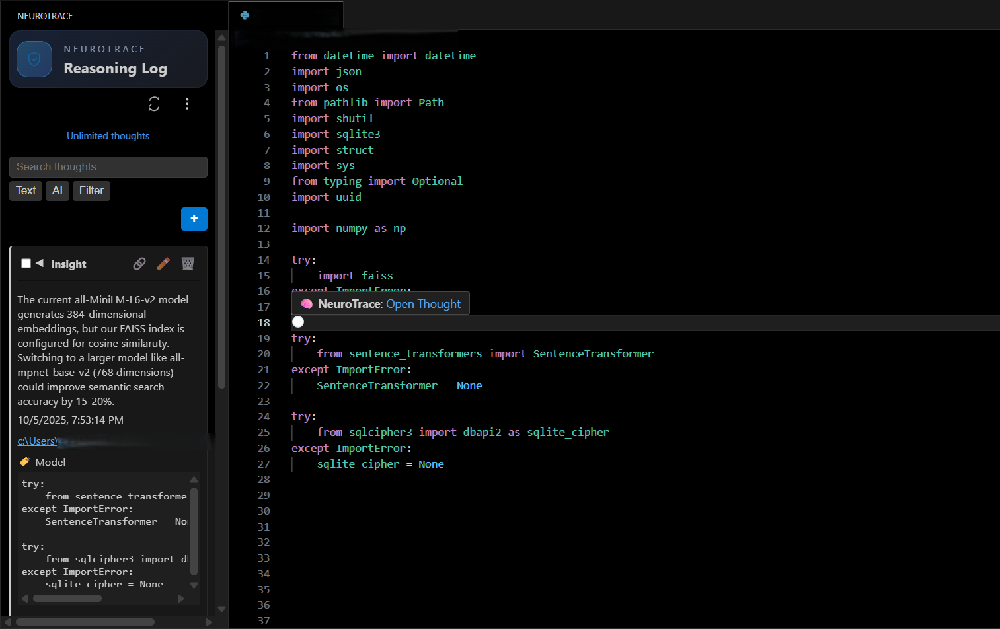
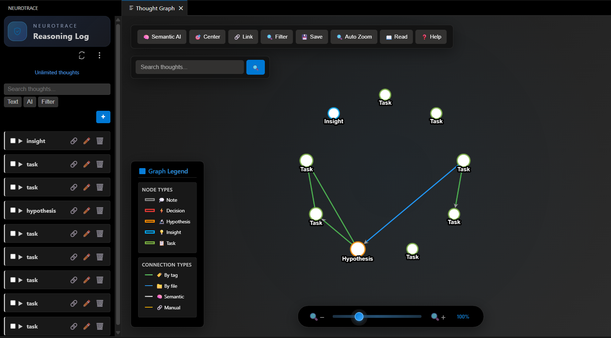

# NeuroTrace

### Local Reasoning Versioning for Developers > Your second brain in VS Code. Reasoning, notes, tasks and more linked to your code, stored 100% offline and secure. 
 
 ---
 
 ## ✨ What it looks like
 
 ### Sidebar with Thoughts
 
 
 
 ### Interactive Thought Graph
 
 
 
 ---
 
 ## 🚀 Why NeuroTrace?
 
 * Capture **hypotheses, decisions, insights, and tasks** right next to your code.
 * **Stay secure:** all reasoning is stored locally and encrypted by default.
 * **Boost productivity:** semantic search and graph visualization help you see patterns others miss.
 * Works **100% offline** — no cloud, no leaks, no distractions.

## 🆓 Free vs Premium

| Feature                                                    | Free Plan (Forever) | Premium (US$9.99/mo) |
| ---------------------------------------------------------- | ------------------- | -------------------- |
| Local Reasoning Log                                        | ✅                   | ✅                    |
| Inline Code Decorations                                    | ❌                   | ✅                    |
| Thought Limit                                              | ⚠️ **45/month**      | ✅ **Unlimited**      |
| Text Search                                                | ✅                   | ✅                    |
| Semantic Search (all-MiniLM-L6-v2 of SentenceTransformers) | ❌                   | ✅                    |
| Related Thought Suggestions                                | ❌                   | ✅                    |
| Interactive Thought Graph                                  | ❌                   | ✅                    |
| Encrypted Storage (AES-256)                                | ✅                   | ✅                    |
| Works Offline                                              | ✅                   | ✅                    |

---

## 🔒 Privacy & Security by Design

For maximum transparency, all security-critical code is open source in our [GitHub repository](https://github.com/BlackIron-Technologies/Neurotrace_c). You can verify that our privacy claims match our code.

* **100% Local:** Everything stays on your machine
* **Encrypted Storage:** SQLite + SQLCipher3 (AES-256 at rest)
* **Anonymous Telemetry:** Optional usage stats
* **Works Offline:** No cloud required

---

### 🛠️ Installation & Usage

1.  **Install from Marketplace**
    - Search for "NeuroTrace" in the Extensions panel (`Ctrl+Shift+X`).
    - Click **Install**.
    - **Note:** When you first open the NeuroTrace sidebar, click the download button to get the AI backend (up to 250MB) including the AI model (all-MiniLM-L6-v2) and general dependencies for extension functions. This is a one-time download that enables powerful offline AI features.

2.  **Initialize in Your Workspace**
    - The NeuroTrace sidebar appears automatically after installation.
    - Click the "Initialize Database" button in the sidebar. This will create the local `.neurotrace` folder.

3.  **Add .neurotrace to .gitignore (Recommended)**
    - To prevent accidentally sharing your encrypted database with others, add `.neurotrace/` to your `.gitignore` file.
    - This ensures your personal thoughts and reasoning data remain private.

4.  **Add Your First Thought**
    - Open any code file.
    - Select your Snipet
    - Press `Alt+N` **or click the "+" button** in the NeuroTrace sidebar.
    - Fill in your idea and press Enter. You're all set!
 
   More details in [walkthrough/init.md](walkthrough/init.md)

🎉 Done! Your reasoning is now versioned locally.

---

## 🏗️ Backend Architecture

NeuroTrace uses a **platform-aware backend system** that automatically detects your operating system:

### Windows, Linux & macOS
- ✅ **Download platform-specific executable on first use**
- ✅ No Python installation required
- ✅ Works out of the box

### Key Technologies
- **SQLCipher3:** Encrypted database with AES-256
- **FAISS:** High-speed semantic search engine
- **Sentence Transformers:** AI-powered embeddings (all-MiniLM-L6-v2)

---

## ✨ Premium Features & Account Management

### Accessing Premium Features

To unlock premium features like unlimited thoughts, semantic search, and the interactive thought graph:

1. **Open Advanced Settings:**
   - Use the Command Palette (`Ctrl+Shift+P`)
   - Run "NeuroTrace: Open Advanced Settings"
   - Or click the settings button in the NeuroTrace sidebar

2. **Sign in with GitHub:**
   - In Advanced Settings, click "Sign in with GitHub"
   - Complete the OAuth flow in your browser
   - Return to VS Code - you'll be automatically signed in

3. **Manage your account:**
   - View your authentication status
   - Subscribe to premium features
   - Sign out when needed

All account management is handled through the **Advanced Settings** panel for a clean, centralized experience.

---

## � Quick Troubleshooting

### Subscription Status Not Updating?

If your premium subscription status isn't reflecting correctly in the extension:

**Quick Fix:**
1. **Sign out and sign back in:**
   - Open Advanced Settings (`Ctrl+Shift+P` → "NeuroTrace: Open Advanced Settings")
   - Click "Sign Out"
   - Click "Sign in with GitHub" and complete the login process

**Alternative:**
- Close and reopen the Advanced Settings panel
- The extension will automatically sync your latest subscription status

This usually resolves sync issues between your account and the extension.

### Database Corrupted or Inaccessible?

If you encounter database errors, corruption, or can't access your thoughts:

**Reset Database:**
1. **Close VS Code completely**
2. **Delete the `.neurotrace` folder** from your workspace root
3. **Restart VS Code** and open your workspace
4. **Re-initialize:** Click "Initialize Database" in the NeuroTrace sidebar

**⚠️ Warning:** This will permanently delete all your thoughts and data. Make sure to export any important thoughts first using the export feature.

---

## �💬 Support & Community

Need help or want to connect with other NeuroTrace users?

- **X (Twitter)**: [@NeuroTraceVsc](https://x.com/NeuroTraceVsc)
- **Email**: neuro_support@blackironhq.com

We're here to help! Feel free to reach out with questions, suggestions, or feedback.

---

## 📄 License

NeuroTrace uses a **hybrid licensing model**: security-critical code is open source, while premium features remain proprietary. See [LICENSE.md](LICENSE.md) for complete terms.

---
> Version your reasoning.  🧠
> © 2025 BlackIron Technologies Ltd. All rights reserved.
---
