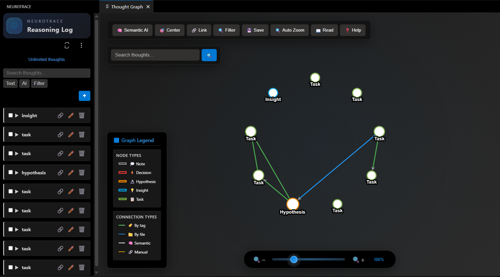

# NeuroTrace MCP

## Persistent Memory for AI Agents That Lives With Your Code

Persistent project memory for developers and coding agents inside the IDE.

---

## See NeuroTrace In Action

<video src="https://raw.githubusercontent.com/BlackIron-Technologies/Neurotrace_c/main/media/readme_optimized.mp4" autoplay loop muted playsinline controls preload="metadata" poster="https://raw.githubusercontent.com/BlackIron-Technologies/Neurotrace_c/main/media/sidebar-screenshot.png" width="960"></video>

**Your agent starts every new chat with amnesia.**

NeuroTrace gives developers and coding agents a local-first, code-linked memory layer that survives across chats and sessions.

NeuroTrace helps agents and developers:

- Save high-signal memory during real work
- Retrieve project context before coding
- Reuse decisions, tasks, and insights across sessions
- Keep memory attached to the codebase instead of the chat

> Built for long-running codebases, debugging, planning, architecture work, and agent-assisted development.

---

## Quick Start

1. Install NeuroTrace from the VS Code Marketplace.
2. Open the NeuroTrace sidebar.
3. Download the platform backend if prompted.
4. Click **Initialize Database**.
5. Let NeuroTrace generate the MCP setup and host-specific guidance for your workspace.
6. Start a fresh agent chat and use NeuroTrace in that repo.

Generated setup includes:

- `.neurotrace/mcp/README.md` with ready-to-use MCP templates
- `.cursor/rules/neurotrace.mdc` for Cursor when supported
- `.github/copilot-instructions.md` for Copilot workflows in VS Code
- automatic Codex MCP rebinding to the active workspace

More details: [walkthrough/init.md](walkthrough/init.md)

---

## How It Works

NeuroTrace gives coding agents a persistent memory layer they can query before acting and update after the work is done.

**Typical workflow:**

1. The agent receives a task.
2. It checks NeuroTrace for prior decisions, tasks, and related context.
3. It works with project history available inside the workspace.
4. It saves the outcome as a structured memory.
5. It links important context for future sessions.

Key MCP capabilities include:

- Create and edit structured memories
- Search by keyword or semantic meaning
- Retrieve file-scoped context
- Discover related memories and graph connections
- Check database readiness before work begins

---

## What NeuroTrace Sets Up

After initialization, NeuroTrace prepares the workspace for both humans and agents:

- Creates the local `.neurotrace` workspace directory
- Stores the project memory database locally
- Auto-configures supported agent hosts where possible
- Generates MCP setup files under `.neurotrace/mcp/`
- Generates host-specific guidance such as `.cursor/rules/neurotrace.mdc` or `.github/copilot-instructions.md`

For client-specific setup and troubleshooting:

- `.neurotrace/mcp/README.md`
- [walkthrough/init.md](walkthrough/init.md)

---

## Interactive Graph

NeuroTrace also includes a graph view for exploring connected project memory.

---

## Privacy And Security

For transparency, security-critical code is open source in our [GitHub repository](https://github.com/BlackIron-Technologies/Neurotrace_c).

- 100% local-first storage
- Encrypted database support (SQLCipher3, AES-256 at rest)
- Optional anonymous telemetry
- Works offline

See also:

- [docs/PRIVACY.md](docs/PRIVACY.md)
- [docs/TELEMETRY.md](docs/TELEMETRY.md)

---

## Support

- **X (Twitter):** [@NeuroTraceVsc](https://x.com/NeuroTraceVsc)
- **Email:** [neuro_support@blackironhq.com](mailto:neuro_support@blackironhq.com)

## License

NeuroTrace uses a hybrid licensing model: security-critical code is open source, while premium features remain proprietary. See [LICENSE.md](LICENSE.md) for complete terms.

---

> Built to remember.  
> © 2026 BlackIron Technologies Ltd. All rights reserved.
