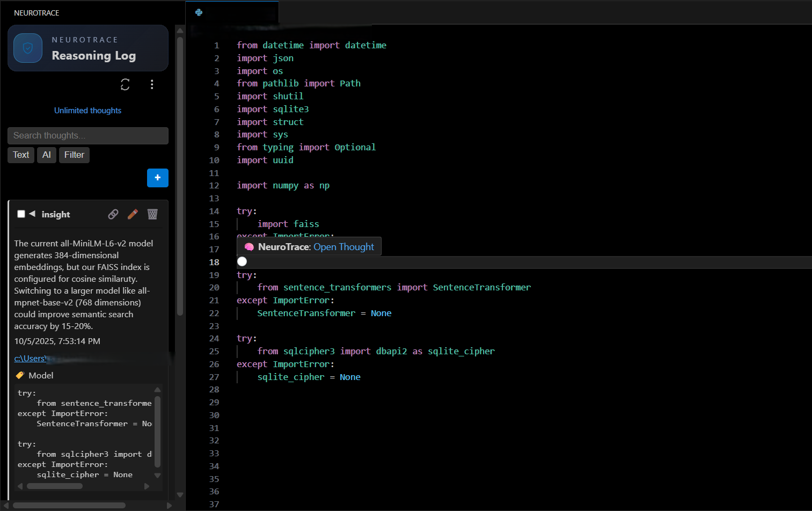

# NeuroTrace

### Context Memory for AI-Assisted Coding

NeuroTrace is a local-first memory system for AI coding agents and developers inside your IDE.

It captures decisions, insights, hypotheses, and tasks **linked directly to your code**, allowing both developers and AI agents to retrieve the reasoning behind a project.

Git tracks the history of code.
NeuroTrace tracks the history of reasoning.

Perfect for: architecture decisions, debugging logs, feature planning, technical journaling, and long-running project context.

---

## 🎬 See NeuroTrace In Action

<video src="https://raw.githubusercontent.com/BlackIron-Technologies/Neurotrace_c/main/media/readme_optimized.mp4" autoplay loop muted playsinline controls preload="metadata" poster="https://raw.githubusercontent.com/BlackIron-Technologies/Neurotrace_c/main/media/sidebar-screenshot.png" width="960"></video>

---

## ✨ What It Looks Like

### Sidebar with Memories

### Interactive Memory Graph

---

## 🚀 Why NeuroTrace?

- Capture structured memory where the work happens.
- Link memory entries to real files, lines, and snippets.
- Search by text and semantic meaning.
- Visualize relationships in an interactive graph.
- Keep everything local-first and offline-friendly.

---

## 🤖 Built for AI Agents

NeuroTrace works as persistent memory for coding agents.

Instead of losing context between sessions, agents can search previous decisions, record new insights, and build on existing knowledge automatically.

**A typical agent workflow:**

1. Agent receives a task.
2. Searches NeuroTrace for prior decisions and related context.
3. Works with full project history available.
4. Records the outcome as a structured memory entry.
5. Links it to related memories in the graph.

NeuroTrace exposes its full API through MCP-compatible tools:

- `addThought` / `editThought` / `deleteThought` — manage structured memory entries.
- `searchThoughts` / `semanticSearch` — find by keyword or meaning
- `suggestRelated` — discover connections
- `addRelation` / `deleteRelation` — link ideas explicitly
- `getGraphData` / `getGraphInsights` — read the knowledge graph
- `getDatabaseStatus` — check workspace state

NeuroTrace ships with pre-configured agent instructions (`.github/copilot-instructions.md`) so agents know how to use the memory system out of the box.

---

## 🧠 Memory Types

NeuroTrace supports structured memory types for better long-term memory:

- `hypothesis` for assumptions to validate
- `decision` for final technical choices
- `insight` for discoveries and learnings
- `task` for follow-up work and debt
- `discard` for rejected approaches
- `note` for general context

---

## 🔒 Privacy and Security by Design

For transparency, security-critical code is open source in our [GitHub repository](https://github.com/BlackIron-Technologies/Neurotrace_c).

- 100% local-first storage
- Encrypted database support (SQLCipher3, AES-256 at rest)
- Optional anonymous telemetry
- Works offline

---

## 🛠️ Installation and First Use

1. Install from Marketplace
- Search for NeuroTrace in the Extensions panel (`Ctrl+Shift+X`).
- Click Install.

2. Open the NeuroTrace sidebar
- On first use, download the platform backend when prompted.
- This one-time download includes the local AI/search runtime.

3. Initialize your workspace database
- Click Initialize Database in the sidebar.
- NeuroTrace will create a local `.neurotrace` directory in your workspace.

4. Add your first memory
- Open a code file.
- Select a snippet.
- Press `Alt+N` or click `+` in the sidebar.
- Save

More details: [walkthrough/init.md](walkthrough/init.md)

---

## 🏗️ Backend Distribution

NeuroTrace downloads platform-specific backend executables from GitHub Releases.

Expected release assets:

- `neurotrace-windows.zip`
- `neurotrace-linux.zip`
- `neurotrace-macos.zip`

Expected binaries inside extracted content:

- Windows: `neurotrace.exe`
- Linux: `neurotrace`
- macOS: `neurotrace`

---

## 🧩 Core Technologies

- SQLCipher3 for encrypted local storage
- FAISS for high-speed vector search
- Sentence Transformers (all-MiniLM-L6-v2) for embeddings

---

## 🛟 Quick Troubleshooting

### Backend download succeeded, but executable was not found

- Verify release tag and asset names match the expected format.
- Re-download backend from NeuroTrace advanced commands.
- If needed, remove cached backend files and download again.

### Database corrupted or inaccessible

1. Close VS Code.
2. Delete the `.neurotrace` folder in your workspace.
3. Reopen VS Code.
4. Initialize database again from the NeuroTrace sidebar.

Warning: this permanently removes local thoughts in that workspace.

---

## 💬 Support & Community

Need help or want to connect with other NeuroTrace users?

- **X (Twitter)**: [@NeuroTraceVsc](https://x.com/NeuroTraceVsc)
- **Email**: neuro_support@blackironhq.com

We're here to help! Feel free to reach out with questions, suggestions, or feedback.

## 📄 License

NeuroTrace uses a **hybrid licensing model**: security-critical code is open source, while premium features remain proprietary. See [LICENSE.md](LICENSE.md) for complete terms.

---
> Built to remember. 🧠
> © 2025 BlackIron Technologies Ltd. All rights reserved.
---
